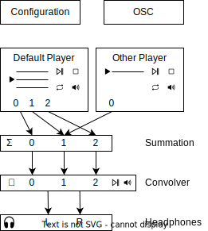

.. image:: https://travis-ci.org/pyBinSim/pyBinSim.svg?branch=master
    :target: https://travis-ci.org/pyBinSim/pyBinSim

PyBinSim
========

Install
-------

Let's create a virtual environment. Use Conda to do this and then use `pip` to install the dependencies.

Windows
-------

Assuming you are using the default command line 
(navigate to `pyBinSim/` folder in Explorer, click into the address bar, type `cmd` and hit enter).

python

::

    $ <PathToPython >= 3.8> -m venv venv
    $ venv/Scripts/activate.bat
    $ pip install pybinsim

For Powershell, the activation command is `venv/Scripts/Activate.ps1`.

conda

::

    $ conda create --name binsim python=3.10 numpy
    $ conda activate binsim
    $ pip install pybinsim

Linux
-----

On linux, make sure that gcc and the development headers for libfftw and portaudio are installed, before invoking `pip install pybinsim`.

For ubuntu

::

    $ apt-get install gcc portaudio19-dev libfftw3-dev

For Fedora

::

    $ sudo dnf install gcc portaudio19-devel fftw-devel

python

::

    $ <PathToPython >= 3.10> -m venv venv
    $ source venv/bin/activate
    $ pip install pybinsim

conda

::

    $ conda create --name binsim python=3.10 numpy
    $ conda activate binsim
    $ pip install pybinsim
    
Run
---

Create ``pyBinSimSettings.txt`` file with content like this

::

    soundfile signals/speech2_48000_mono.wav
    blockSize 512
    ds_filterSize 256
    early_filterSize 3072
    late_filterSize 48640
    filterSource[mat/wav] mat
    filterDatabase brirs/example_mat.mat
    filterList brirs/filtermap_example.txt
    maxChannels 1
    samplingRate 48000
    enableCrossfading True
    useHeadphoneFilter False
    headphone_filterSize 1024
    loudnessFactor 3
    loopSound True
    pauseConvolution False
    pauseAudioPlayback False
    torchConvolution[cpu/cuda] cpu
    torchStorage[cpu/cuda] cpu
    ds_convolverActive True
    early_convolverActive True
    late_convolverActive True

Start Binaural Simulation

::

    import pybinsim
    import logging

    pybinsim.logger.setLevel(logging.DEBUG)    # defaults to INFO
    #Use logging.WARNING for printing warnings only

    with pybinsim.BinSim('pyBinSimSettings.txt') as binsim:
        binsim.stream_start()

Description
===========

Basic principle:
----------------

Depending on the number of input channels (wave-file channels) the corresponding number of virtual sound sources is created. The filter for each sound source can selected and activitated via OSC messages. The messages basically contain the number
index of the source for which the filter should be switched, an identifier string and a key to address the correct filter. Each key corresponds to one filter. 

pyBinSim now features upto three separate convolvers which enables you to exchange filter parts in real-time. Each convolver runs independently from the others and their results are summed together. This needs to be considered when creating the corresponding filters.

Also, pyBinSim offers you the possibility to run the convolution on a CUDA based graphics card. Especially for long filters (several seconds) or/and multiple sound sources this can lead to a signficant speedup.

    
Config parameter description:
-----------------------------

soundfile: 
    Defines \*.wav file which is played back at startup. Sound file can contain up to maxChannels audio channels. Also accepts multiple files separated by '#'; Example: 'soundfile signals/sound1.wav#signals/sound2.wav'. The corresponding player is called ``config_soundfile``. When config parameter is missing, nothing is played at startup. 
blockSize: 
    Number of samples which are processed per block. Low values reduce delay but increase cpu load.
ds_filterSize: 
    Defines filter size of the direct sound filters. Filter size must be a mutltiple of blockSize. If your filters are a different length, they are either shortened or zero padded to the size indicated here. Filter smaller than the blockSize are zero padded to blockSize.
early_filterSize: 
    Defines filter size of the early filters. Filter size must be a mutltiple of blockSize. If your filters are a different length, they are either shortened or zero padded to the size indicated here.
late_filterSize: 
    Defines filter size of the late reverb filters. Filter size must be a mutltiple of blockSize. If your filters are a different length, they are either shortened or zero padded to the size indicated here.
headphone_filterSize: 
    Defines filter size of the headphone compensation filters. Filter size must be a mutltiple of blockSize.
filterSource[mat/wav]:
    Choose between 'mat' or 'wav' to indicate wether you want to use filters stored as mat file or as seperate wav files
filterDatabase:
    Enter path to the mat file containing your filters. Check example for structure of the mat file
filterList:
    Enter path to the filtermap.txt which specifies the mapping of keys to filters stored as wav files. Check example filtermap for formatting.
maxChannels: 
    Maximum number of sound sources/audio channels which can be controlled during runtime. The value for maxChannels must match or exceed the number of channels of soundFile(s). If you choose thi value to high, processing power will be wasted.
samplingRate: 
    Sample rate for filters and soundfiles. Caution: No automatic sample rate conversion.
enableCrossfading: 
    Enable cross fade between audio blocks. Set 'False' or 'True'.
useHeadphoneFilter: 
    Enables headhpone equalization. The filterset should contain a filter with the identifier HPFILTER. Set 'False' or 'True'.
loudnessFactor: 
    Factor for overall output loudness. Attention: Clipping may occur
loopSound:
    Enables looping of sound file or sound file list. Set 'False' or 'True'.
pauseConvolution:
    Bypasses convolution
pauseAudioPlayback:
    Audio playback is paused (convolution is still running)
torchConvolution[cpu/cuda]:
    Choose 'cpu' when convolution should be done on CPU or 'cuda' when you intend to you use a cuda enabled graphics cards. 
    For the latter, make sure torch is installed by CUDA support (which is not the case with the default pip installation mentioned above).    
    Check this: https://pytorch.org/get-started/locally/
torchStorage[cpu/cuda]:
    Choose 'cpu' when filter should be stored in the RAM or 'cuda' when you want to store filters directly on the graphics card memory.
    For the latter, make sure torch is installed by CUDA support (which is not the case with the default pip installation mentioned above).    
    Check this: https://pytorch.org/get-started/locally/
ds_convolverActive:
    Enables or disables convolver. When only one convolver is needed, its adviced to disable the others to save performacne. Set 'False' or 'True'.
early_convolverActive: 
    Enables or disables convolver. Set 'False' or 'True'.
late_convolverActive:
    Enables or disables convolver. Set 'False' or 'True'.

Usage of filter lists and wav based filters:

Example lines from filter list:

::

    HP hpirs/DT990_EQ_filter_2ch.wav
    DS 165 2 0 0 0 0 0 0 0 0 0 0 0 0 0 brirs/kemar_0_165_ds.wav
    ER 165 2 0 0 0 0 0 0 0 0 0 0 0 0 0 brirs/kemar_0_165_early.wav
    LR 0 2 0 0 0 0 0 0 0 0 0 0 0 0 0 brirs/late_reverb.wav

Lines with the prefix DS, ER and LR contain a 'filter key' which consist of 9 or 15 intger numbers. They are used to tell pyBinSim which filter to apply. These numbers can be arbitrarily assigned to suit your use case, but for conistency with mat based filters its adivced to assign the numbers in the following order:

For 9 digit keys:

::
Value 1-3 : listener orientation [yaw, pitch, roll]
Value 4-6 : listener position [x, y, z]
Value 7-9 : custom values [a, b, c]

For 15 digit keys:

::

Value 1-3 : listener orientation [yaw, pitch, roll]
Value 4-6 : listener position [x, y, z]
Value 7-9 : source orientation [yaw, pitch, roll]
Value 10-12 : source position [x, y, z]
Value 13-15 : custom values [a, b, c]

The filter behind the prefix HP will be loaded and applied automatically when useHeadphoneFilter == True.
Lines which start with DS,ER or LR have to be called via OSC commands to become active.

Usage of filter stored in MATLAB mat files
------------------------------------------

A mat file should contain one ore more variables containing your filters. The maximum size for on variable in mat files version 7 is limited to 2GB. All variables are combined inside binsim and their naming can be arbitrarily. However, the variables must be struct arrays with following fields:

::

"type" ['DS','ER','LR','HP]
"ListenerOrientation" [array(int, int ,int)]
"ListenerPosition" [array(int, int ,int)]
"SourceOrientation" [array(int, int ,int)]
"SourcePosition" [array(int, int ,int)]
"custom" [array(int, int ,int)]
"filter" [array(single,2), array(double,2)]

For headhpone filters, only the field filter is relevant. To reduce memory usage we advise to use single precision for the filters. To speedup the filter loading we advice to store the mat files on a SSD and to save the mat files without compression (which is not the default setting in MATLAB). Also take a look at the example_mat.mat file to understand the structure. 

OSC & ZMQ Messages Examples:
----------------------------

Lines with the prefix DSFILTER, EARLYFILTER and LATEFILTER contain a 'filter key' which consist of 6 or 9 positive numbers. These numbers
can be arbitrarily assigned to suit your use case. They are used to tell pyBinSim which filter to apply.
The filter behind the prefix HPFILTER will be loaded and applied automatically when useHeadphoneFilter == True.
Lines which start with DSFILTER, EARLYFILTER or 'LATEFILTER' have to be called via OSC or ZMQ commands to become active.
To activate a DSFILTER for the third channel of your wav file you have to send the the identifier
'/pyBinSim_ds_Filter', followed by a 2 (corresponding to the third channel) and followed by the nine 9 key numbers from the filter list
to the pc where pyBinSim runs (protocol and address are configurable, defaults to tcp://127.0.0.1:10001):

::

    ZMQ:    ['/pyBinSim_ds_Filter', 2, 165, 2, 0, 0, 0, 0, 0, 0, 0]
    OSC:    /pyBinSim_ds_Filter 2 165 2 0 0 0 0 0 0 0 0 0 0 0 0 0

When you want to apply an early filter

::

    ZMQ:    ['/pyBinSim_early_Filter', 2, 0, 2, 0, 0, 0, 0, 0, 0, 0]
    OSC:    /pyBinSim_early_Filter 2 0 2 0 0 0 0 0 0 0 0 0 0 0 0 0

When you want to apply a late filter

::

    ZMQ:    ['/pyBinSim_late_Filter', 2, 0, 2, 0, 0, 0, 0, 0, 0, 0]
    OSC:    /pyBinSim_late_Filter 2 0 2 0 0 0 0 0 0 0 0 0 0 0 0 0
      
        
When you want to play another sound file you send:

::

    ['/pyBinSimFile', 'folder/file_new.wav']

This stops all other players and plays the sound file on a new player called ``config_soundfile``. If you want to play a sound file list:

::

    ['/pyBinSimFile', 'folder/file_1.wav#folder/file_2.wav']

The audiofile has to be located on the pc where pyBinSim runs. Files are not transmitted over network.

Because of issues with OSC when many messages are sent, multiple OSC receivers are used. Commands related to the ds_Filter should be addressed to port 10000, early_Filter commands to port 10001, late_Filter commands to port 10002 and all other commands to port 10003. This will probably be changed in future releases.

Further Messages:
=================

Pause all audio playback. Send 'True' or 'False' (as string, not bool). Individual player controls remain unchanged.

::

    ZMQ:    ['/pyBinSimPauseAudioPlayback, 'True']
    OSC:    /pyBinSimPauseAudioPlayback {pausePlayback: string["True"|"False"]}

Bypass convolution. Send 'True' or 'False' (as string, not bool).

::

    ZMQ:    ['/pyBinSimPauseConvolution', 'True']
    OSC:    /pyBinSimPauseConvolution {pauseConvolution: string["True"|"False"]}

Change global loudness. Send float value. Volume of individual players is not affected.

::

    ZMQ:    ['/pyBinSimLoudness', {loudness: float32}]
    OSC:    /pyBinSimLoudness {loudness: float32}

Create a new player. Players can play back files independent from each other. A
player's output is sent to the start channel and consecutive channels, up to the
channel count of the current sound file. If a player with the same name is
already present, a new one with the same name will be created and used instead. 

::
    
    ZMQ:    ['/pyBinSimPlay', {soundfile_list: string}, {start_channel: int32 = 0}, {loop: string["loop"|"single"] = "single"}, {player_name: string|int32|float32 = soundfile_list}, {volume: float32 = 1.0}, {play: string["play"|"pause"] = "play"}]
    OSC:    /pyBinSimPlay {soundfile_list: string} {start_channel: int32 = 0} {loop: string["loop"|"single"] = "single"} {player_name: string|int32|float32 = soundfile_list} {volume: float32 = 1.0} {play: string["play"|"pause"] = "play"}   

Pause, stop or start a player.

::

    /pyBinSimPlayerControl {player_name: string} {play: string["play"|"pause"|"stop"]}

Change the output channel of a player.

::

    /pyBinSimPlayerChannel {player_name: string} {start channel: int32} 

Change the volume of a player.

::

    /pyBinSimPlayerVolume {player_name: string} {volume: float32|int32}

Stop all players.

::

    /pyBinSimStopAllPlayers

Create a new player. Players can play back files independent from each other. A
player's output is sent to the start channel and consecutive channels, up to the
channel count of the current sound file. If a player with the same name is
already present, a new one with the same name will be created and used instead. 

::

    /pyBinSimPlay {soundfile_list: string} {start_channel: int32 = 0} {loop: string["loop"|"single"] = "single"} {player_name: string|int32|float32 = soundfile_list} {volume: float32 = 1.0} {play: string["play"|"pause"] = "play"}   

Pause, stop or start a player.

::

    /pyBinSimPlayerControl {player_name: string} {play: string["play"|"pause"|"stop"]}

Change the output channel of a player.

::

    /pyBinSimPlayerChannel {player_name: string} {start channel: int32} 

Change the volume of a player.

::

    /pyBinSimPlayerVolume {player_name: string} {volume: float32|int32}

Stop all players.

::

    /pyBinSimStopAllPlayers

Signal Flowchart
------------------------------

This flowchart shows how players can be independently controlled and that multiple players can feed any given convolver channel.

Reference:
----------

Please cite our work:

Neidhardt, A.; Klein, F.; Knoop, N. and Köllmer, T., "Flexible Python tool for dynamic binaural synthesis applications", 142nd AES Convention, Berlin, 2017.

